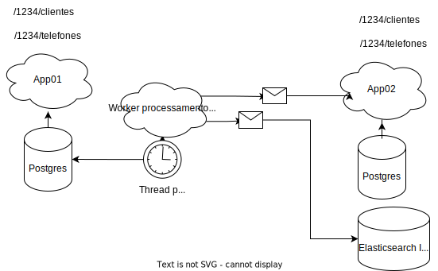

# visão geral

Conforme descrito, este exemplo faz uso de comunicação assíncrona, através da biblioteca [nsj-queue-lib](https://github.com/Nasajon/nsj-queue-lib).

No cenário apresentado temos um serviço que chamareamos de **App01** e que possui as figuras de **clientes** e **telefones**, onde um cliente pode possuir N contatos. De outro lado temos o serviço **App02**, que possui as figuras de **pessoas** e **contatos**, que para simplificar possui a mesma modelagem do primeiro serviço.

Neste exemplo suponha que a **App02** depende de dados que são do domínio da **APP01**, que é quem possui as funcionalidades de cadastro. Sempre que houverem novos dados estes deverão ser replicados e ainda deverá existir um índice que suporta Full Text Search, que poderá ser consultado acerca do resumo destes dados.

O modelo de comunicação pode ser conferido abaixo:

[Original](https://drive.google.com/file/d/1_YFh_mwDNHKPqwl1Iz56Bm7UzDuedC_q/view?usp=sharing)

Quando as apis de Clientes de Telefones (App01) são utilizadas como escrita, uma notificação é gravada na tabela `public.fila_cliente` contendo além de do id do registro no campo `"payload"`, um valor que identifica o processo, no exemplo `fila_cliente_subscriber`no campo `"processo"`. Esta notificação ocorre dentro do escopo da transação da api; após isso o motor do quelib entra em ação, notificando os interessados em escutar esta notificação.

Na tabela [`public.fila_cliente_subscriber`](../database/dump/create.sql) temos uma configuração para dois id's assinantes do processo : `api_faturamento_pessoas` e `api_indice_pessoas`, que são processados na classe [`WorkerSincroniaClientes`](../nasajon/worker/worker_sincronia_clientes.py), através dos métodos `sinc_cliente` e `sinc_indice` que são decorados por esses id's e fazem as atualizações na api de pessoas/contatos e no índice de pessoas (faturamento.pessoa). As notificações são processadas individualmente por cada assinante, de forma que as falhas individuais não afetam outros assinantes.

## Código

As classes que valem destaque para a compreensão deste exemplo são:

[Fila de Clientes](../nasajon/service/filas/fila_cliente.py), que abstrai as operações de enfileiramento de notificações para [nsj-queue-lib](https://github.com/Nasajon/nsj-queue-lib).

Apis de [Clientes](../nasajon/controller/clientes_controller.py) e [Telefones](../nasajon/controller/telefones_controller.py), que representam a origem dos dados.

Apis de [Pessoas](../nasajon/controller/pessoas_controller.py) e [Contatos](../nasajon/controller/contatos_controller.py), que representam o destino dos dados.

[Worker de Clientes](../nasajon/worker/worker_sincronia_clientes.py), que efetua o despacho dos dados, quer seja ele nas apis de destino, quer seja no [índice](elasticsearch.md).

## Outras informações

As informações referentes ao índice no Elasticsearch e seu funcionamento podem ser consultadas [neste documento](elasticsearch.md).

